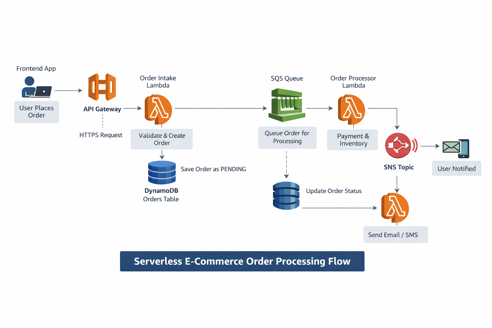

# Project Diagram



# Serverless Order Processing Application

This project demonstrates a **simple, production-style serverless application** using **AWS API Gateway, AWS Lambda, and DynamoDB**, with a **Python client application** acting as the frontend.

The goal of this project is to understand **how a request flows through a serverless system**, from a client to AWS services, without managing any servers.

---

## 🧩 What This Application Does

* A client application (Python script) runs on your local machine
* It sends an order request to **API Gateway**
* API Gateway triggers a **Lambda function**
* Lambda stores and processes the order using AWS services
* The client receives an immediate response

This mimics how real-world web and mobile applications interact with cloud backends.

---

## 🏗️ Architecture Overview

```
Python App (Laptop)
        ↓ HTTPS
API Gateway
        ↓
Lambda (Order Intake)
        ↓
DynamoDB (Orders Table)
        ↓
SQS (Order Queue)
        ↓
Lambda (Order Processor)
        ↓
DynamoDB (Update Order Status)
        ↓
SNS → Notifications
```

There are **no always-running servers**. Each AWS service is triggered only when needed.

---

## 📂 Project Structure

```
AWS-LAMBDA+APIGW+DYNAMODB-PROJECT/
│
├── application/
│   └── app.py              # Python client application
│
├── lambda/
│   └── order_intake.py     # Lambda function (backend)
│
└── README.md               # This file
```

---

## 🧑‍💻 Client Application (Python)

The Python script acts as a **frontend client**.

It:

* Runs locally on your laptop
* Sends an HTTP POST request to API Gateway
* Does NOT know about Lambda, SQS, or DynamoDB

### What the Python app sends

```json
{
  "items": [
    { "productId": "A1", "qty": 2 }
  ],
  "paymentMethod": "card"
}
```

---

## 🔄 Application Flow (Step-by-Step)

### 1. User runs the Python app

The user executes:

```bash
python3 app.py
```

---

### 2. Python app calls API Gateway

* Sends an HTTPS request to `/orders`
* Includes JSON order data

At this point:

* Nothing is running in AWS yet

---

### 3. API Gateway receives the request

API Gateway:

* Acts as the public entry point
* Validates the request
* Forwards it to Lambda

---

### 4. Lambda function runs

The **Order Intake Lambda**:

* Parses the request
* Generates a unique `orderId`
* Stores the order as `PENDING` in DynamoDB
* Pushes the order to SQS for processing

---

### 5. Immediate response is returned

The client receives:

```json
{
  "orderId": "ORD-123",
  "status": "PENDING"
}
```

The user does **not** wait for payment or inventory processing.

---

### 6. Order is processed asynchronously

* SQS triggers another Lambda
* Inventory and payment are processed
* Order status is updated to `PAID` or `FAILED`
* Notifications are sent via SNS

This happens **after** the client already got a response.

---

## ⚙️ Why This Design Is Used

This architecture is widely used in production because it:

* Scales automatically
* Handles traffic spikes safely
* Is fault tolerant
* Has no server management
* Is cost-efficient (pay per request)

---

## ❗ Important Concepts

* The Python app is **not Lambda**
* Lambda runs only inside AWS
* API Gateway is the only public endpoint
* The system is **event-driven**, not server-based

---

## ▶️ How to Run the Application

1. Make sure Python is installed

```bash
python3 --version
```

2. Install dependencies

```bash
pip3 install requests
```

3. Update `API_URL` in `app.py`

4. Run the app

```bash
python3 app.py
```

---

## 🧠 Key Takeaway

This project shows how **a simple client application can trigger powerful backend logic in AWS** using serverless services — without managing or deploying any servers.

---

## 📌 Next Improvements (Optional)

* Add authentication (Cognito + JWT)
* Add order status polling
* Build a web frontend
* Add monitoring and alerts
* Deploy frontend to S3 + CloudFront

---

**Author:** Your Name
**Purpose:** Learning & understanding serverless architecture
 